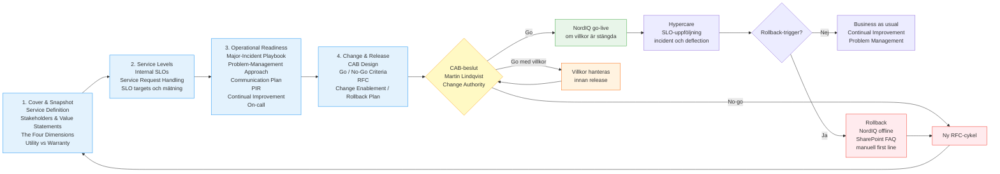
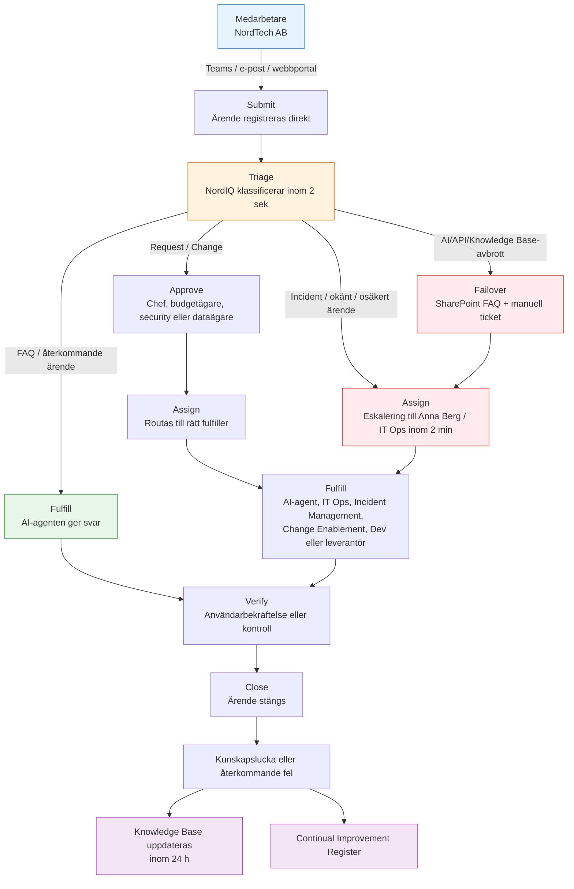
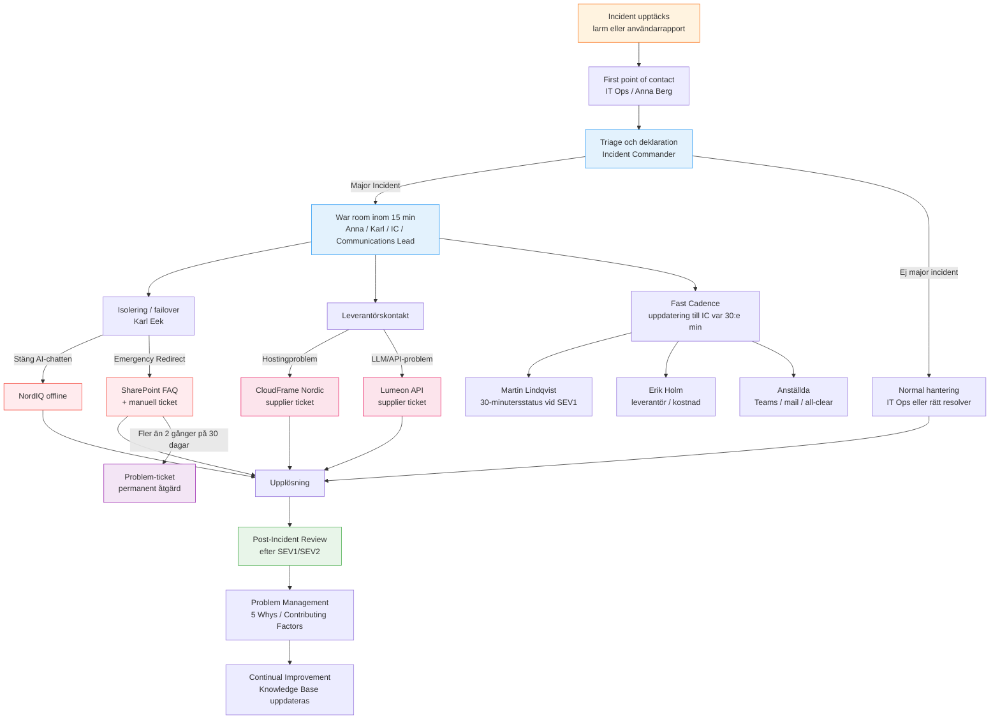

# GO-LIVE READINESS PACKAGE

> **A S S I G N M E N T · I P L 2 5**
> **NordIQ — AI-stödd First-Line Support**
> **NordTech AB**
> **Maj 2026**

**Prepared by**

- Simon Fredling Jack
- Jonas Öhrn
- Emma Hörnberg
- Annika Mellgren
- Filippa Skauby Killick

---

Det här är GitHub-versionen av NordIQ:s **Go-Live Readiness Package**. Källan för paketets struktur och innehåll är [NordIQ_Go-Live_Readiness_Package-v2.md](NordIQ_Go-Live_Readiness_Package-v2.md). README fungerar som ingång till presentationen, dokumenten och Mermaid-flödena, inte som en ny version av uppgiften.

NordIQ beskrivs som en intern IT-tjänst för NordTech AB, inte som en fristående chatbot eller teknikdemo. Paketet ska ge CIO och CAB ett beslutsunderlag för **villkorad go-live**, där kvarstående risker, verifieringsbehov och rollback-väg är synliga innan produktion.

Go-live är alltså inte godkänd i detta repo. Värden som inte är verifierade ska läsas som **targets**, **go/no-go criteria**, **assumptions** eller **verification needs**.

---

## Service Definition

NordIQ är en AI-stödd intern first-line supporttjänst som gör det möjligt för NordTechs medarbetare att få snabbare hjälp med vanliga IT-supportbehov, utan att behöva vänta på manuell first-line-hantering eller förstå vart ärendet ska routas.

Tjänsten ska ta emot supportförfrågningar, klassificera dem, besvara återkommande ärenden när Knowledge Base räcker och eskalera ärenden som kräver mänsklig hantering till rätt supportflöde.

NordIQ:s servicevärde ligger i kortare väntetid, lägre belastning på first line och tydligare escalation när AI-agenten inte ska eller kan lösa ärendet själv.

---

## Case Baseline

| Area | Case fact |
|------|-----------|
| Organisation | NordTech AB, cirka 450 medarbetare |
| Current first-line volume | Cirka 70 ärenden per dag |
| Current first-line staffing | 4 personer |
| Current average resolution | 2,5 dagar |
| Recurring / FAQ-classified tickets | Cirka 40 % |
| NordIQ target | 40-60 % first-line deflection |
| Service ambition | 24/7 entry point för first-line support |
| Hosting dependency | CloudFrame Nordic hostar AI Agent Platform |
| LLM dependency | Lumeon API är LLM API-beroende |

---

## Package Artifacts

| # | Artifact | Purpose | Contains | File |
|---|----------|---------|----------|------|
| 1 | **Cover & Snapshot** | Describes NordIQ in service language, not as a stack. | Service Definition, Stakeholder Map, Value · Utility · Warranty, The Four Dimensions | [docs/1. Cover & Snapshot.md](docs/1.%20Cover%20%26%20Snapshot.md) |
| 2 | **Service Levels** | Defines what "good enough" means before go-live. | Internal SLOs, rationale per target, how each is measured, Service Request Handling | [docs/2. Service Levels.md](docs/2.%20Service%20Levels.md) |
| 3 | **Operational Readiness** | Shows how NordIQ runs day-to-day and recovers when it breaks. | Major-Incident Playbook, Problem-Management Approach, Continual Improvement Register, On-call & Escalation Map | [docs/3. Operational Readiness.md](docs/3.%20Operational%20Readiness.md) |
| 4 | **Change & Release** | Defines the plan to take NordIQ into production and back out. | RFC for go-live, CAB Design, Go/No-Go Criteria, Rollback Plan | [docs/4. Change & Release.md](docs/4.%20Change%20%26%20Release.md) |

Det finns inga extra huvudartefakter i denna karta. Risker, stakeholders, Continual Improvement och CAB-berättelsen hanteras inom de fyra delarna ovan.

---

## Readiness Flow



Mermaid source: [diagrams/Go-Live Readiness Package.mmd](diagrams/Go-Live%20Readiness%20Package.mmd)

---

## Service Request Handling



Mermaid source: [diagrams/2.2 Service Request Handling.mmd](diagrams/2.2%20Service%20Request%20Handling.mmd)

---

## On-call & Escalation Map



Mermaid source: [diagrams/3.6 On-call & Escalation Map.mmd](diagrams/3.6%20On-call%20%26%20Escalation%20Map.mmd)

---

## Common Service Language

| Term | How it is used here |
|------|---------------------|
| **Service** | NordIQ är en intern IT-tjänst som möjliggör snabbare first-line support för NordTechs medarbetare. |
| **Service consumer** | Medarbetare på NordTech som använder NordIQ för IT-supportbehov. |
| **Utility** | Vad NordIQ gör: självbetjäning, triage, escalation och förbättringsdata. |
| **Warranty** | Hur tjänsten måste fungera tillräckligt bra: availability, continuity, korrekt information och fungerande escalation. |
| **SLO / SLI** | SLO är internt mål; SLI är mätvärdet som visar om målet uppnås. |
| **Incident** | Oplanerad händelse som orsakar eller riskerar avbrott i tjänsten eller supportflödet. |
| **Problem Management** | Hantering av bakomliggande orsaker till återkommande incidents. |
| **Change Enablement** | Kontrollerad hantering av förändringen att ta NordIQ mot produktion. |
| **RFC** | Request for Change för NordIQ go-live. |
| **CAB** | Change Advisory Board som ger beslutsunderlag till Change Authority. |
| **Continual Improvement Register** | Register över förbättringar som kommer från incidenter, användarfeedback, SLO-avvikelser och Knowledge Base-luckor. |

För att undvika missförstånd används inte `CI` som kortform för Continual Improvement i README. Om Configuration Item avses ska det skrivas ut som **Configuration Item (CI)**.

---

## Verification Boundary

| Item | Status in this package |
|------|------------------------|
| Go-live approval | Ej beslutat |
| SLO baseline | Behöver mätas i test, pilot eller begränsad rollout |
| Rollback | Dokumenterad som plan och go/no-go-villkor; behöver verifieras |
| CloudFrame Nordic | Hosting dependency; faktisk SLA/supportväg behöver granskas |
| Lumeon API | LLM dependency; SLA, latens och tokenkostnad behöver följas upp |
| Deflection 40-60 % | Target, inte uppmätt resultat |
| Continual Improvement | Register/hantering beskrivs; förbättringar är inte verifierat genomförda |

---

## Mockup

[mockup/](mockup/) innehåller en klickbar medarbetaryta för NordIQ. Mockupen visar servicebeteende och supportflöde, inte produktionsklar LLM-integration eller CAB-godkänd driftberedskap.

```bash
cd mockup
npm install
npm run dev
npm run typecheck
```

---

## How to Use This Repository

1. Läs [NordIQ_Go-Live_Readiness_Package-v2.md](NordIQ_Go-Live_Readiness_Package-v2.md) som källmaterial.
2. Använd de fyra dokumenten i [docs/](docs/) som presentationens artifact-delar.
3. Använd Mermaid-diagrammen i [diagrams/](diagrams/) för GitHub-renderade flöden och diffbara ändringar.
4. Behandla SLO, rollback, supplier constraints och deflection som verifieringspunkter innan CAB kan fatta go/no-go-beslut.
