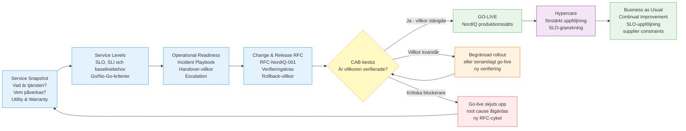
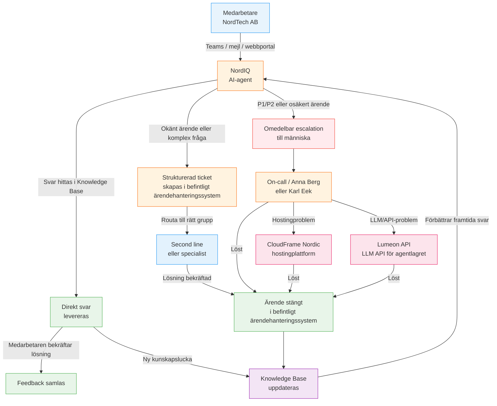
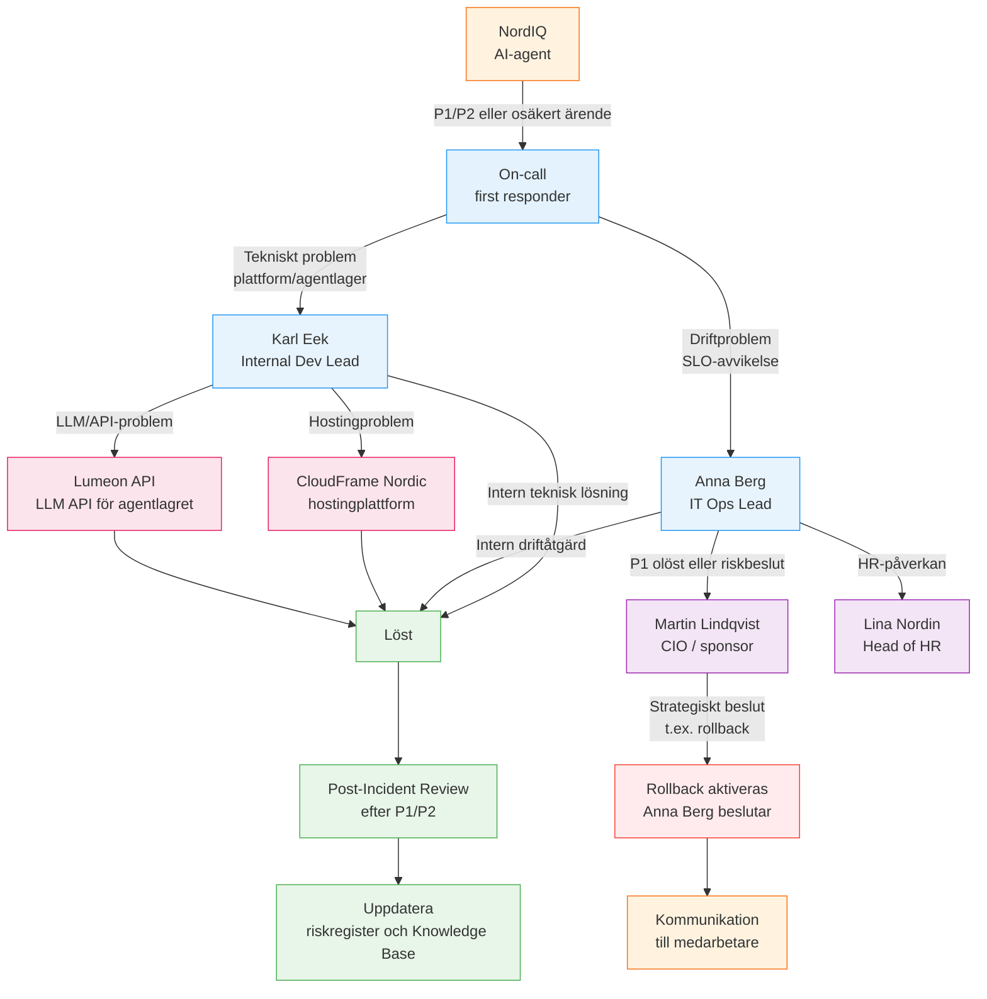

# GO-LIVE READINESS PACKAGE

> **A S S I G N M E N T · I P L 2 5**
> **NordIQ — AI-stödd First-Line Support**
> **NordTech AB**
> **Maj 2026**

**Prepared by**

- Simon Fredling Jack
- Jonas Öhrn
- Emma Hörnberg
- Annika Mellgren
- Filippa Skauby Killick

---

## Service Definition

NordIQ är en AI-stödd intern first-line supporttjänst för NordTech AB:s medarbetare. Tjänsten gör det möjligt för service consumers att få snabbare hjälp med vanliga IT-supportbehov utan att behöva vänta på manuell first-line-hantering eller förstå hur ärendet ska routas internt.

NordIQ tar emot supportförfrågningar, klassificerar dem, besvarar återkommande FAQ-liknande ärenden när Knowledge Base räcker och eskalerar ärenden som kräver mänsklig hantering till rätt supportflöde.

Tjänsten ska skapa värde genom kortare väntetid, lägre repetitiv first-line-belastning och mer strukturerade escalations. NordIQ ersätter inte mänskligt ansvar för kritiska, osäkra eller känsliga ärenden.

---

## Case Baseline

| Area | Case fact |
|------|-----------|
| Organisation | NordTech AB, cirka 450 medarbetare |
| Current first-line volume | Cirka 70 ärenden per dag |
| Current first-line staffing | 4 personer |
| Current average resolution | 2,5 dagar |
| Recurring / FAQ-classified tickets | Cirka 40 % |
| NordIQ target | 40-60 % first-line deflection |
| Service ambition | 24/7 first-line entry point |
| Hosting dependency | CloudFrame Nordic hosts the AI Agent Platform |
| LLM dependency | Lumeon API is the LLM API for the agent layer |

---

## Decision Path

Det här repo:t är docs-as-code: Markdown-filerna är källan, Mermaid-diagrammen renderas direkt i GitHub och ändringar kan granskas som diffar.



Mermaid source: [diagrams/go-live-readiness-flow.mmd](diagrams/go-live-readiness-flow.mmd)

---

## Artifact Map

| CAB question | Artifact | File |
|--------------|----------|------|
| What is the service and value case? | Cover & Snapshot / Service Snapshot | [docs/01-service-snapshot.md](docs/01-service-snapshot.md) |
| What does "good enough" mean before go-live? | Service Levels & SLOs | [docs/02-service-levels-slo.md](docs/02-service-levels-slo.md) |
| How does NordIQ run and recover when it breaks? | Operational Readiness | [docs/03-operational-readiness.md](docs/03-operational-readiness.md) |
| What is the change, who decides, and how do we back out? | Change & Release / RFC | [docs/04-change-release-rfc.md](docs/04-change-release-rfc.md) |
| What risks remain? | Risk Register | [docs/risk-register.md](docs/risk-register.md) |
| How are improvements tracked? | Continual Improvement Register | [docs/ci-register.md](docs/ci-register.md) |
| Who is affected and how should they be handled? | Stakeholder Map | [docs/stakeholder-map.md](docs/stakeholder-map.md) |
| How should the CAB story be presented? | CAB Presentation Outline | [docs/cab-presentation-outline.md](docs/cab-presentation-outline.md) |

Docs portal: [docs/README.md](docs/README.md)

---

## Service Request Flow



Mermaid source: [diagrams/service-flow.mmd](diagrams/service-flow.mmd)

---

## Escalation Map



Mermaid source: [diagrams/escalation-map.mmd](diagrams/escalation-map.mmd)

---

## Verification Boundary

Det här paketet stödjer ett villkorat CAB-beslut. Det ska inte läsas som bevis på att go-live redan är godkänd.

| Item | Status in this package |
|------|------------------------|
| Go-live approval | Ej beslutat |
| SLO baseline | Behöver mätas i test, pilot eller begränsad rollout |
| Rollback | Dokumenterad som villkor, behöver verifieras |
| CloudFrame Nordic | Hosting dependency, faktisk SLA/supportväg behöver granskas |
| Lumeon API | LLM dependency, SLA/latens/tokenkostnad behöver följas upp |
| Deflection 40-60 % | Target, inte uppmätt resultat |
| Continual Improvement | Register finns; förbättringar är inte verifierat genomförda |

---

## Mockup

[mockup/](mockup/) innehåller en klickbar medarbetaryta för NordIQ. Mockupen visar servicebeteende, inte produktionsklar LLM-integration eller CAB-godkänd driftberedskap.

```bash
cd mockup
npm install
npm run dev
npm run typecheck
```
